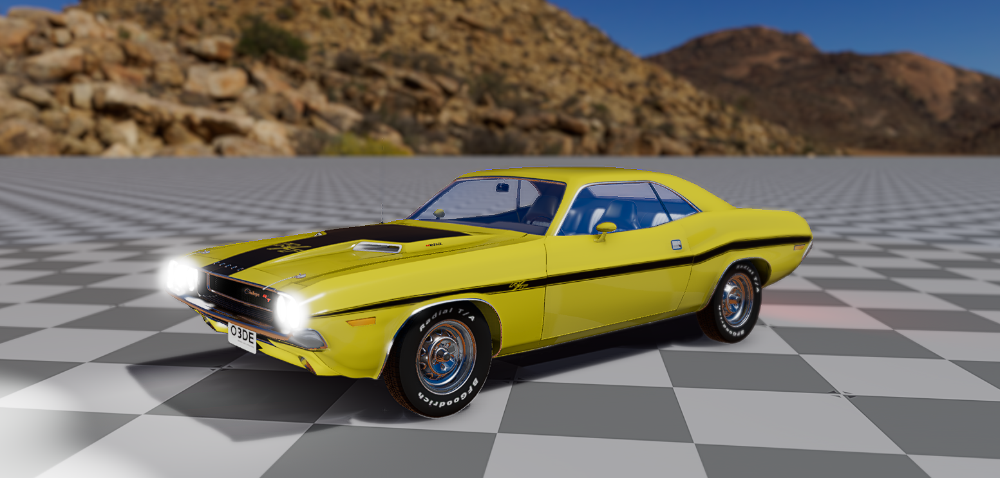
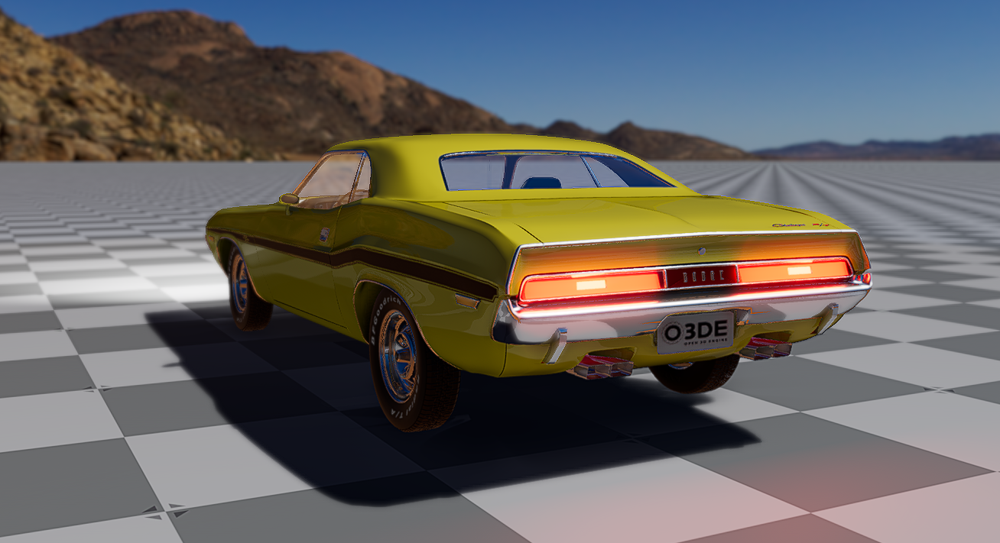

# O3DE Dodge Challenger 1970 R/T test project

by Paweł Budziszewski

## Overview

This is a test project for:
- [My repository with O3DE sample vehicle assets](https://github.com/pawelbudziszewski/o3de-sample-vehicle-assets)
- [Robotec's Vehicle Dynamics Gem](https://github.com/RobotecAI/o3de-vehicle-dynamics-gem)

It contains a Dodge Challenger model, on a sample scene.

## Usage

To run it you need to:
- Install the [O3DE engine](https://o3de.org/download)
- Clone the [Robotec's Vehicle Dynamics Gem](https://github.com/RobotecAI/o3de-vehicle-dynamics-gem) and register it in the engine
- Clone the [Sample Vehicle Assets Gem](https://github.com/pawelbudziszewski/o3de-sample-vehicle-assets) and register it in the engine
- Clone this repository, build and run the project

Please refer to the [O3DE User Guide](https://www.docs.o3de.org/docs/user-guide/) if you need more information about this process.

## Notes

Tested on:
- Vehicle Dynamics Gem ver. 1.0.0
- O3DE ver. 24.09.0 (should also run fine in 24.09.1)
- Windows 11, Ubuntu Linux 22.04
